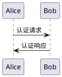

# UML Render

在网页上即时渲染 PlantUML 代码块为图片的 Chrome 扩展。

## 功能特性

- 自动识别并渲染 PlantUML 代码块
- 支持 PNG 和 SVG 两种输出格式
- 支持多种 PlantUML 主题
- 图片查看器：滚轮缩放、拖拽平移、双击切换大小
- 点击图片可复制到剪贴板
- 支持多个 PlantUML 服务器
- 智能缓存机制，避免重复渲染

## 支持平台

### 已测试平台
- **金山文档**：完整支持，主要测试平台
- **GitHub**：支持

### 理论支持
- **Notion、飞书、语雀**：未实测
- **其他 Markdown 平台**：未实测

**如遇到问题，请开启调试模式并查看控制台日志，反馈给开发者。**

**GitHub 使用提示**：在代码块中标记语言为 `plantuml`：

```plantuml
@startuml
...
@enduml
```


## 安装方法

1. 下载本项目到本地
2. 打开 Chrome，访问 `chrome://extensions/`
3. 开启右上角"开发者模式"
4. 点击"加载已解压的扩展程序"
5. 选择本项目目录

## 使用方法

1. 点击扩展图标，确保"启用渲染"已开启
2. 在支持的网页中编写 PlantUML 代码
3. 扩展自动识别并渲染为图表
4. 点击图表放大查看
   - 滚轮缩放（以鼠标位置为中心）
   - 拖拽移动
   - 双击切换适应窗口/原始大小
   - 点击"复制图片"按钮复制到剪贴板

### PlantUML 代码示例



## 配置选项

点击扩展图标打开设置面板：

- **启用渲染**：开启/关闭自动渲染
- **输出格式**：PNG（默认）或 SVG
- **图表主题**：默认主题、Materia（Material风格）、Spacelab（现代简洁）、Cerulean-Outline（清新线框）、Vibrant（活力多彩）、Plain（极简黑白）
- **PlantUML 服务器**：
  - 官方服务器（推荐）：`https://www.plantuml.com/plantuml`
  - Kroki.io服务器（备用）：`https://kroki.io`
  - HTTP 备用：`http://www.plantuml.com/plantuml`
  - 自定义服务器地址
- **调试模式**：开启后在控制台输出详细日志
- **强制刷新**：清除缓存并重新渲染所有图表

## 数据安全

- 只读取网页中显示的代码块，不访问文档其他内容
- 不调用网页平台 API，不获取用户身份信息
- PlantUML 代码编码后发送到服务器，服务器不存储
- 可使用自建服务器确保数据完全私有

## 调试方法

1. 开启扩展的"调试模式"
2. 按 F12 打开浏览器开发者工具
3. 查看 Console 标签页的日志输出：
   ```
   [UMLRender] 扫描到 N 个代码块
   [UMLRender] 识别 PlantUML #0
   [UMLRender] 渲染成功
   ```
4. 如果渲染失败，检查：
   - 网络连接是否正常
   - PlantUML 代码语法是否正确
   - 服务器地址是否可访问
   - 控制台是否有错误信息

## 开发说明

开发相关内容请查看 [开发指南.md](开发指南.md)

## 常见问题

**Q: 图表不显示？**

A: 检查网络连接、PlantUML 代码语法、开启调试模式查看日志

**Q: Kroki 服务器某些主题渲染失败？**

A: Kroki.io 对 materia 主题支持有限，使用该主题会自动切换为 default。其他主题可正常使用

**Q: 如何自建 PlantUML 服务器？**

A: 参考 https://plantuml.com/zh/starting

## 许可证

本项目采用 **GNU General Public License v3.0 (GPL-3.0)** 开源许可证。

这意味着：
- ✅ 可以自由使用、修改和分发
- ✅ 必须开源：任何修改或衍生作品也必须以 GPL-3.0 发布
- ✅ 保留版权声明和许可证文件
- ✅ 声明修改内容
- ⚠️ 不提供任何担保

详见 [LICENSE](LICENSE) 文件。

## 版本历史

查看 [更新说明.md](更新说明.md)
