# PlantUML 测试示例

## 1. 序列图 - 用户登录流程

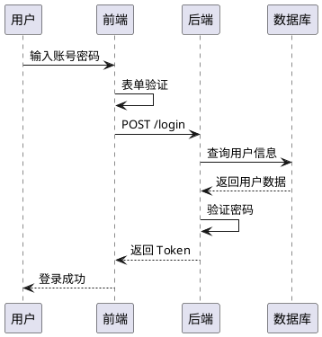

## 2. 类图 - 电商系统

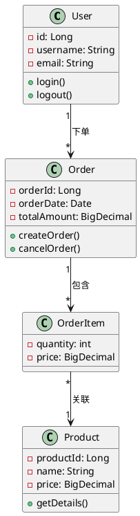

## 3. 用例图 - 在线购物系统

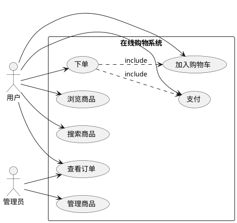

## 4. 活动图 - 订单处理流程

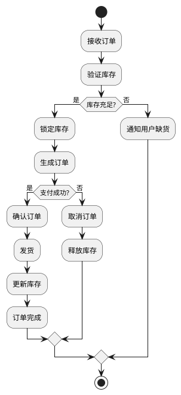

## 5. 状态图 - 订单状态流转

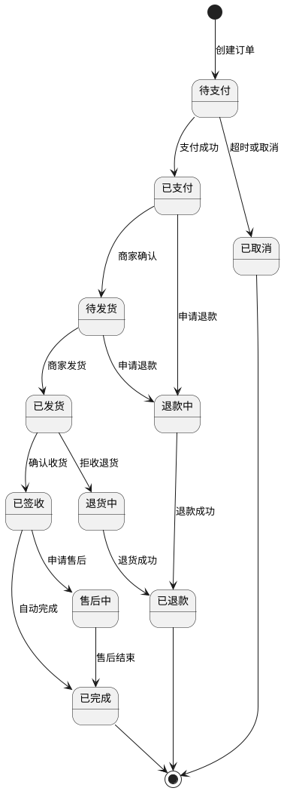

## 6. 组件图 - 微服务架构

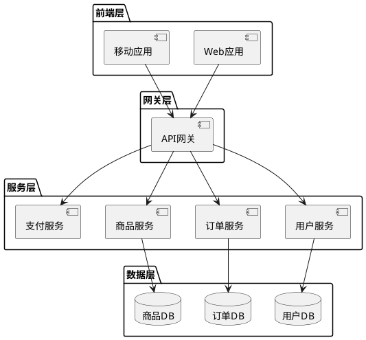

## 7. 部署图 - 系统部署架构

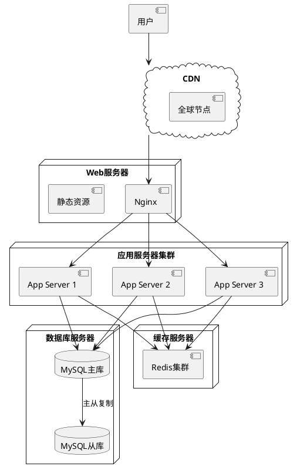

## 8. 时序图 - 复杂支付流程（带分组）

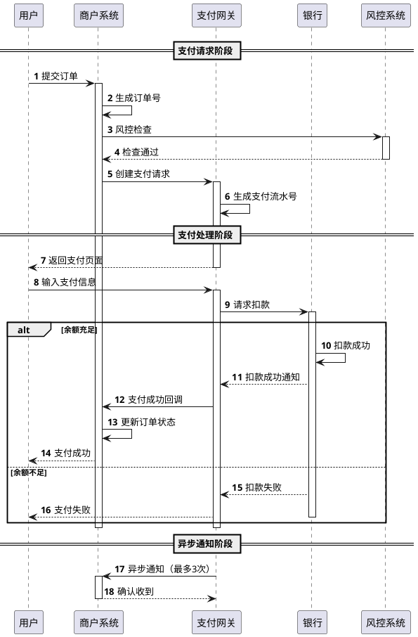

## 9. 对象图 - 订单实例关系

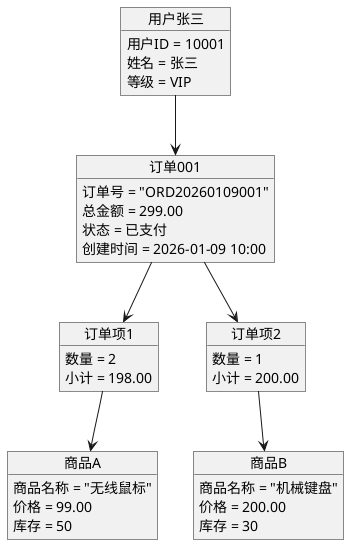

## 10. 包图 - 模块依赖关系

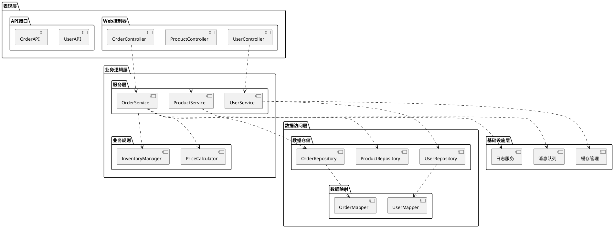

## 11. 特殊字符测试 - 中文标点和符号

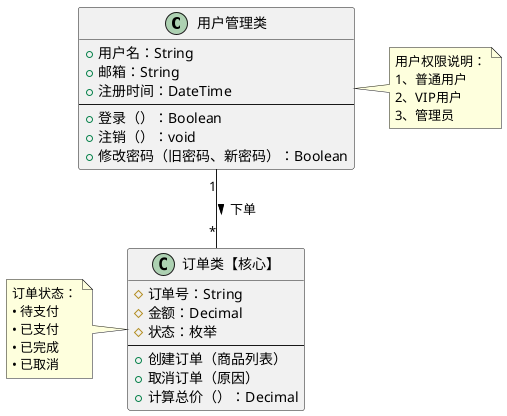

## 12. 时序图 - 分布式事务（Saga模式）

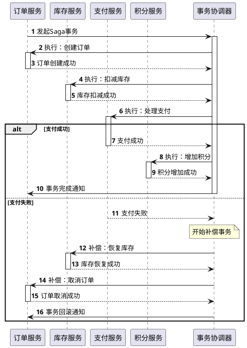

## 13. 类图 - 设计模式示例（观察者模式）

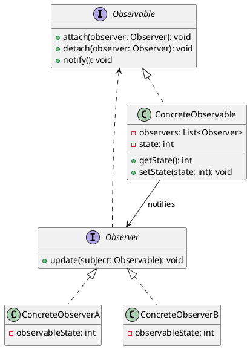

## 14. 活动图 - 用户注册流程（含泳道）

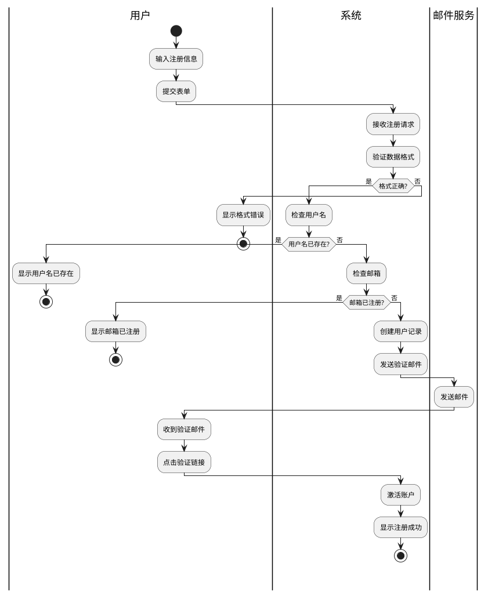

## 15. 简单测试 - 最小化示例

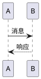

## 16. 复杂测试 - 多层嵌套状态图

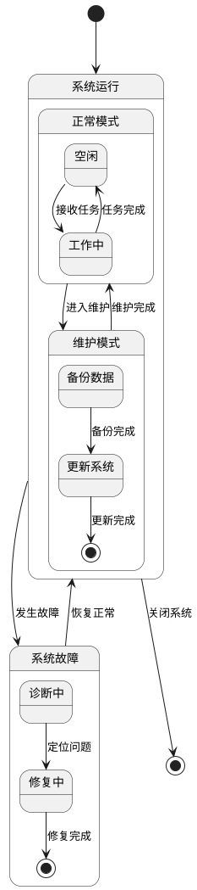

---

## 测试说明

### 基础功能测试
将上述任意代码块复制到金山文档中，UML Render 扩展应该能够：
1. 自动识别 PlantUML 代码（包含 `@startuml` 或 `participant`、`class` 等关键字）
2. 调用 PlantUML 服务器渲染为图片
3. 在代码块下方显示渲染后的 UML 图表
4. 支持点击放大和复制到剪贴板

### 测试重点

#### 1. 类型覆盖测试
- 示例 1-6：常见图表类型
- 示例 7-14：更复杂的图表类型
- 示例 15：极简示例
- 示例 16：复杂嵌套示例

#### 2. 特殊字符测试（示例 11）
测试中文标点和特殊符号：
- 全角标点：：、。【】（）
- 中文符号：•
- 数学符号：>

#### 3. 性能测试
- 单个复杂图表渲染时间
- 多个图表同时渲染
- 页面滚动时的响应速度

#### 4. 边界测试
- 示例 15：最简单的图表
- 示例 16：高度复杂的嵌套结构
- 示例 8、12：带大量注释和分组

### 调试建议

测试过程中：
1. 打开浏览器控制台（F12）查看日志
2. 关注识别阶段的日志（是否找到关键字）
3. 关注编码阶段的日志（编码是否成功）
4. 关注渲染阶段的日志（图片是否加载成功）
5. 如果图片加载失败，复制 URL 直接访问查看错误信息
